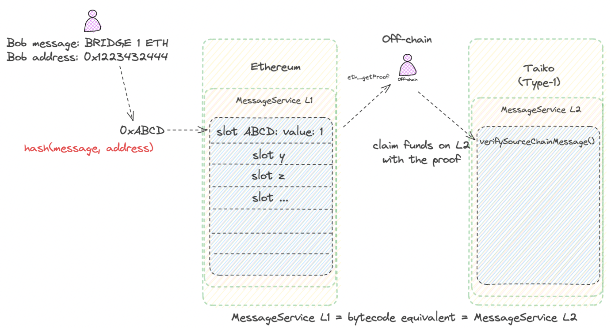

# Message Service dApp (Simple Bridge) for Ethereum Equivalent Chains



## Introduction

This repository contains a simple Message Service dApp that serves as a bridge between Ethereum equivalent chains. The dApp allows you to create and store messages on a source chain and verify their inclusion on a destination chain using Merkle proofs. This forms the fundamental basis of a bridge application.

## Working Behavior

- The dApp deploys the same smart contract on both the source chain and the destination chain.
- Both contracts have the ability to create and store messages at specific storage slots with the value `0x1`.
- You can use `eth_getProof` RPC calls to obtain the Merkle proof of inclusion for a specific message on the source chain.
- This proof can then be presented to the destination chain's smart contract to verify that a specific message has been sent.

## Setup

Before setting up the project, ensure you have [Foundry](https://book.getfoundry.sh/getting-started/installation) installed.

Follow these steps to set up the project:

1. Clone the repository:

   ```bash
   git clone git@github.com:adaki2004/MessageService.git
   cd MessageService

2. Install project dependencies:

    ```bash
    forge install

3. If you want to test a specific message (located in the test/ folder), replace the message string and Ethereum address. Then run the tests using Foundry:
    ```bash
    forge test -vv

4. Deploy (and verify) the smart contracts on both chains using Foundry. Here's an example deployment script (for Sepolia):
    ```bash
    forge create --rpc-url 'https://eth-sepolia.g.alchemy.com/v2/ALCHEMY_API_KEY' --private-key 'YOUR_DEPLOYER_WALLET_PRIV_KEY' --etherscan-api-key 'YOUR_ETHERSCAN_API_KEY' --verify 'src/MessageService.sol:MessageService'

Make sure to replace 'https://eth-sepolia.g.alchemy.com/v2/ALCHEMY_API_KEY', 'YOUR_DEPLOYER_WALLET_PRIV_KEY', and 'YOUR_ETHERSCAN_API_KEY' with the appropriate values.

5. Set the message slot value to `0x1` by calling the `sendMessage` function on the source chain.

6. Call the RPC `eth_getProof` with the contract address and storage slot using the script/eth_getProof.py script. (The raw proof bytes are not RLP encoded so make sure you encode it! For example, you can use: https://toolkit.abdk.consulting/ethereum#key-to-address,rlp )

7. Verify on the destination chain's smart contract using the `verifySourceChainMessage` function, providing the proof that the specific message has been sent.

Please note that this is a basic implementation of a bridge application and is not intended for production use.

This project is licensed under the MIT License.